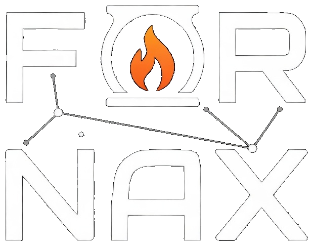

# Fornax

<p align="center">
  
</p>

A microkernel operating system written in Zig. Plan 9's "everything is a file" design meets VMS-style fault tolerance — clean interfaces with the durability to match.

## Why Fornax?

**Everything is a file.** Drivers, network stacks, and block devices all run as userspace file servers speaking plain text. Write to `/dev/gpu/ctl`, read from `/net/arp` — no `ioctl`, no binary protocols.

**VMS-grade durability.** The fault supervisor monitors every userspace server and restarts crashed services transparently. A buggy driver never takes down the system — only the microkernel must be correct.

**Containers without containers.** A container is just `rfork` + `bind` + `mount`. Each process already has its own namespace, so isolation is the default.

**POSIX without compromise.** The kernel speaks only Plan 9-style syscalls. POSIX software runs via a userspace shim that translates Linux syscalls at the crt0 level — `socket()` becomes `open("/net/tcp/clone")`.

**Orchestration without the orchestrator.** Service discovery is `ls /svc/`. Health checks are `read /svc/web/health`. Deployment is writing a text file. Build with `-Dviceroy=true` to include it. *(Planned — see [Phase 3003+](docs/TODO/00-overview.md))*

**Optional clustering.** Nodes discover each other via UDP gossip and import remote namespaces over 9P. Mount another machine's `/dev/` into your local tree. *(Planned — see [Phase 3000+](docs/TODO/00-overview.md))*

**One language, top to bottom.** Kernel, drivers, userspace, and build system — all Zig.

**Built with AI.** Developed collaboratively between a human and [Claude Code](https://claude.com/claude-code). Architecture, code, docs, and debugging — all done in conversation.

## Building

Requires [Zig 0.15.x](https://ziglang.org/download/).

```sh
zig build x86_64     # x86_64 UEFI kernel
zig build riscv64    # riscv64 freestanding kernel
zig build aarch64    # aarch64 UEFI kernel (WIP — no userspace yet)

# Feature flags
zig build x86_64 -Dposix=true         # C/POSIX realm support (musl libc)
zig build x86_64 -Dtcc=true           # TCC compiler (implies -Dposix=true)
zig build x86_64 -Dcontainers=true    # Container system + fnx CLI

# Planned
zig build x86_64 -Dcluster=true       # Multi-node clustering (Phase 3000+)
zig build x86_64 -Dviceroy=true       # Deployment tooling (Phase 3003+, implies cluster)
```

## Running

Requires QEMU with OVMF firmware.

```sh
make run                 # x86_64, single core
make run-smp             # x86_64, 4 cores
make run-riscv64         # riscv64 on QEMU virt
make run-release         # ReleaseSafe kernel
make run-posix           # with POSIX realm support
make run-tcc             # with TCC compiler
make run-containers      # with containers (4 cores, 2 GB)
make run-dev             # development mode (8 cores, 8 GB)
```

This builds the kernel and userspace, creates a disk image with fxfs, and launches QEMU with framebuffer, serial on stdio, virtio-net, virtio-blk, and USB devices.

## Documentation

| Doc | Contents |
|-----|----------|
| [Architecture](docs/architecture.md) | Kernel subsystems, syscall table, boot sequence |
| [SMP](docs/smp.md) | Multi-core design, scheduling, locking, work stealing |
| [Filesystem](docs/fxfs.md) | fxfs CoW B-tree filesystem design |
| [Networking](docs/networking.md) | Protocol stack, virtio driver, userspace netd |
| [Containers](docs/containers.md) | Container system, `fnx` CLI, Linux compat layer |
| [POSIX Realms](docs/posix-realms.md) | C/POSIX support, musl integration, syscall translation |
| [Control Files](docs/ctl.md) | Plan 9-style ctl files across all subsystems |
| [Package Manager](docs/fay.md) | fay package manager design |
| [Roadmap](docs/TODO/00-overview.md) | Phase tracking, milestones, dependency graph |

## License

[MIT](LICENSE)
